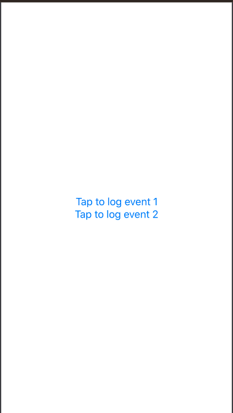

# Django-Swift-Analytics-Example

## Reasoning
This is a demo project showing the possibilities to use Django-powered backend as a very simple analytics platform for mobile app. Created for the purpose of the tech talk in Phonies team, Demant. 

## Installation

### Django part
The `django` directory contains the `requirements.txt` file to use with `pip` to install dependencies. As far as I'm concerned, it's best to use it in `virtualenv`. 

After installing the required dependencies, you can use `./manage.py migrate` to create the database schema. After that `manage.py createsuperuser` would allow to access the admin interface.

#### Development server
To run the development server on the default port (8000) use the following command: `manage.py runserver`. 

### Swift part
Swift part is just a playground. It requires iOS 13 compatible Xcode, because it uses `SwiftUI`. 

The UI is just 2 buttons that log different events, and there's a dumb class that communicates with the analytics server (assuming it's running on localhost, port 8000 - this is easy to change though). 